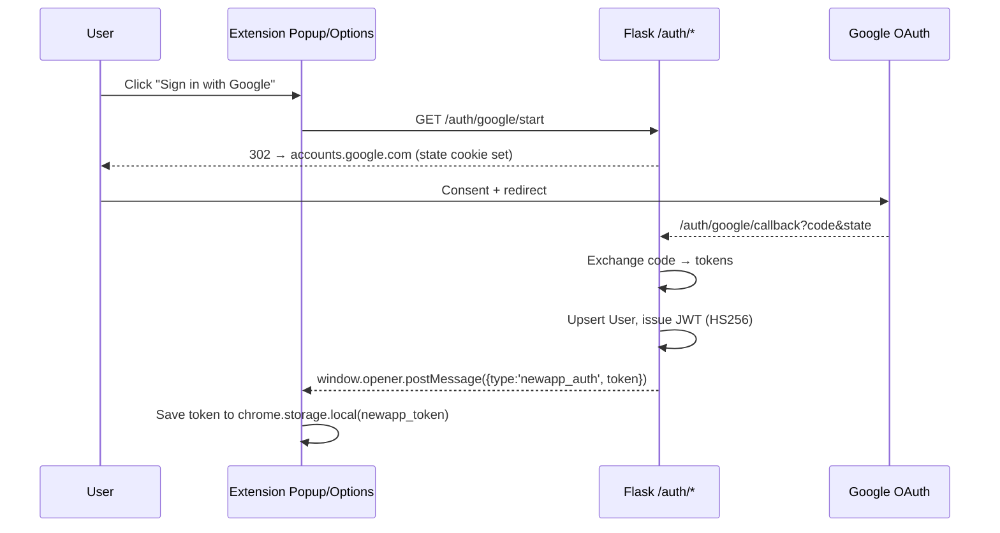
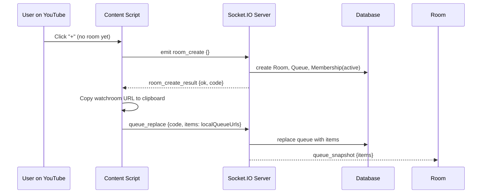
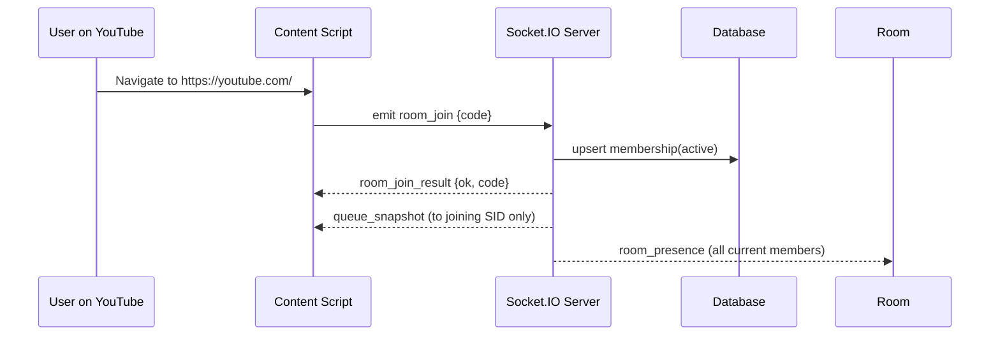
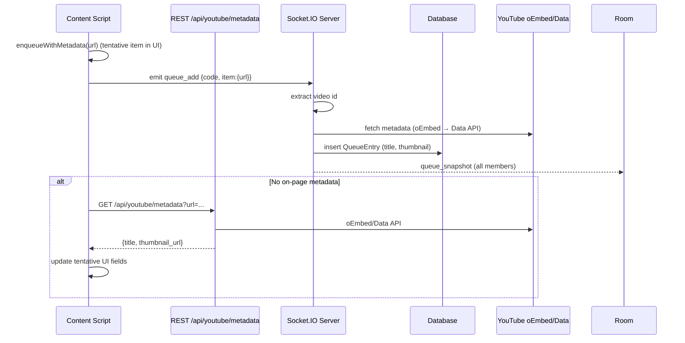
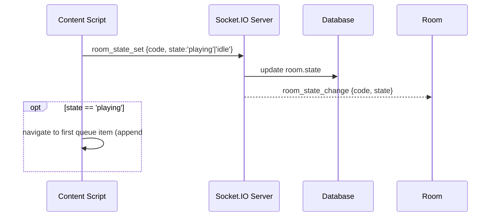
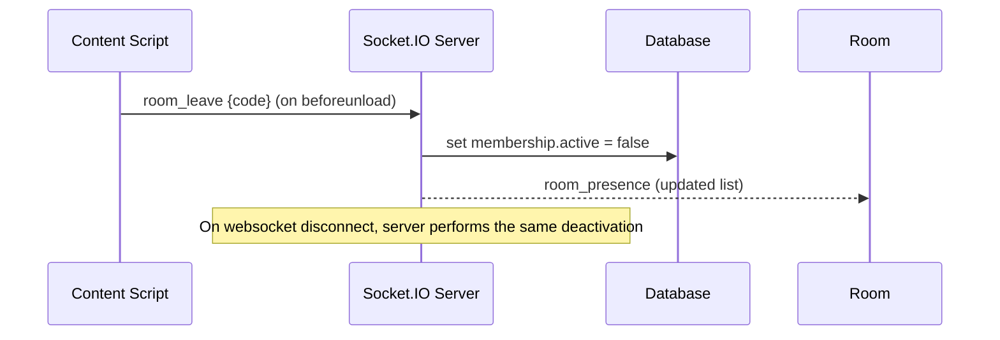
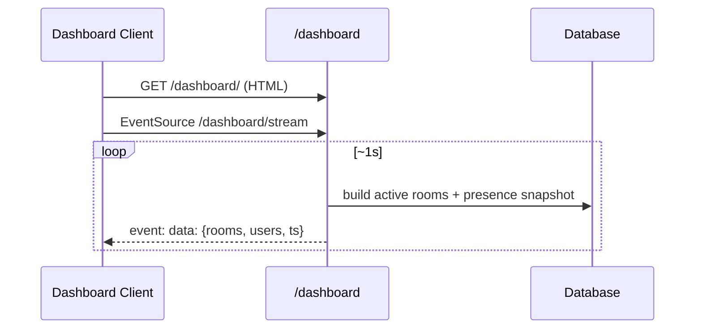

### ShareTube — System Diagram and Lifecycle (Frontend + Backend)

This document explains the overall architecture, core data models, APIs/events, and the end-to-end lifecycle for both the Chrome Extension frontend and the Flask backend.

## High-level Architecture

```mermaid
flowchart TD
  subgraph Browser[User Browser]
    CS[Content Script\nShareTubeApp (zyX UI)]
    POP[Extension Popup/Options]
  end

  subgraph Backend[Flask Backend]
    API[REST API\n/ api/* , /auth/*]
    SIO[Socket.IO Server]
    DB[(SQLite via SQLAlchemy)]
    DASH[Dashboard\nHTML + SSE]
  end

  Google[Google OAuth 2.0]:::ext
  YT[YouTube oEmbed / Data API]:::ext

  classDef ext fill:#eef,stroke:#99f

  CS <--> SIO
  CS -->|GET /api/youtube/metadata| API
  POP -->|Launch /auth/google/start| API
  API -->|Token Exchange /auth/google/callback| Google
  API --> DB
  SIO --> DB
  API -->|oEmbed/Data API| YT

  subgraph Admin[Observer Browser]
    DClient[Dashboard Client]
  end
  DClient -->|GET /dashboard/| DASH
  DClient -->|SSE /dashboard/stream| DASH
```

- **Chrome Extension (MV3)**: Injects a lightweight UI (`ShareTubeApp`) into YouTube pages, manages a local queue, and connects to the backend over Socket.IO using a JWT stored in `chrome.storage.local`.
- **Flask Backend**: Provides REST endpoints (YouTube metadata + Google OAuth), a realtime Socket.IO server for rooms/queues/presence/state, and an admin Dashboard served over HTML + Server-Sent Events.
- **SQLite (SQLAlchemy)**: Persists users, rooms, memberships, queues, and entries.
- **External Services**: Google OAuth for sign-in; YouTube oEmbed/Data API for video metadata.

## Core Data Model (SQLAlchemy)

- **User**: `id, google_sub, email, name, picture`
- **Room**: `id, code, created_by_id, created_at, is_private, state('idle'|'playing')`
- **RoomMembership**: `id, room_id, user_id, joined_at, last_seen, active`
  - Unique `(room_id, user_id)`; toggled `active` on join/leave/disconnect
- **Queue**: `id, room_id, created_by_id, created_at`
- **QueueEntry**: `id, queue_id, added_by_id, url, title, thumbnail_url, position, added_at, status`

## Public Interface

- REST
  - `GET /` → health
  - `GET /api/youtube/metadata?url=...|id=...` → `{id?, title, thumbnail_url, channel_title?}`
  - `GET /auth/google/start` → redirects to Google OAuth
  - `GET /auth/google/callback` → issues short-lived JWT (HS256) and returns it to opener via `postMessage({type:'newapp_auth', token})`
- Dashboard
  - `GET /dashboard/` → HTML page
  - `GET /dashboard/api/snapshot` → JSON with active rooms + presence
  - `GET /dashboard/stream` → SSE stream of snapshots (1s cadence)
- Socket.IO (names are event-based)
  - Client→Server: `ping`, `room_create`, `room_join`, `room_leave`, `queue_replace`, `queue_add`, `queue_remove`, `room_state_set`
  - Server→Client: `hello`, `pong`, `room_create_result`, `room_join_result`, `room_presence`, `queue_snapshot`, `room_state_change`, `system_stats`

## Frontend Lifecycle (Content Script)

1) Inject UI and state
   - Renders pill + queue panel using `zyX`.
   - Binds drag-and-drop to collect URLs; filters for YouTube.
2) Apply identity
   - Reads `newapp_token` from `chrome.storage.local` and sets avatar.
   - Listens for storage changes to update identity live.
3) Lazy realtime connect
   - On-demand `ensureSocket()` connects to backend with `?token=<JWT>`.
   - Registers handlers for presence, queue snapshots, room state, etc.
4) URL hash auto-join
   - If location hash is `#sharetube:<ROOM_CODE>`, emits `room_join` and stores `roomCode`.
5) Queue management
   - Local queue holds `ShareTubeQueueItem`s; metadata filled from page when possible, else fetched via `/api/youtube/metadata` and/or synced from server snapshots.
6) Leave/cleanup
   - On `beforeunload`, emits `room_leave` for the current room.

## Backend Lifecycle (Server)

- App startup
  - Loads config, initializes CORS, SQLAlchemy, Socket.IO, creates tables.
  - Registers dashboard blueprint (HTML + SSE + JSON).
- Auth
  - Minimal Google OAuth code flow; after callback, upserts `User` and issues JWT.
- Socket connect
  - Validates JWT; maps `sid→userId`; starts background system-stats emitter once.
- Room membership
  - `room_create`: creates `Room`, default `Queue`, joins creator, upserts `RoomMembership(active=True)`, emits presence + empty queue snapshot to creator.
  - `room_join`: joins socket room, sets membership active, emits presence + queue snapshot to the joiner.
  - `room_leave`/`disconnect`: sets membership inactive; emits updated presence.
- Queue operations
  - `queue_replace`: replaces full queue list, emits `queue_snapshot` to room.
  - `queue_add`: accepts `{id}|{url}`, extracts YouTube id, fetches metadata (oEmbed → optional Data API), inserts entry, emits `queue_snapshot`.
  - `queue_remove`: soft-deletes entry, emits `queue_snapshot`.
- Room state
  - `room_state_set`: updates `Room.state` and emits `room_state_change`.
- Dashboard
  - Periodically streams active rooms + presence via SSE; HTML renders cards.

## End-to-End Flows

### A) Authentication (initiated from extension popup/options)



Content script passively picks up the token via storage listener and shows avatar; it connects to Socket.IO when needed.

### B) Create Room and Push Local Queue



### C) Join Room via URL Hash and Receive Snapshot



### D) Drag-and-Drop Add to Queue



### E) Play/Pause and Synchronized Navigation



### F) Leave / Disconnect and Presence



### G) Dashboard (SSE) Visibility



## Event Catalog (Socket.IO)

- Client→Server
  - `room_create {}` → Creates room, auto-joins creator.
  - `room_join {code}` / `room_leave {code}` → Enters/leaves logical room; server manages `RoomMembership`.
  - `queue_replace {code, items:[{url|id}]}` → Replace entire queue.
  - `queue_add {code, item:{url|id}}` or `{items:[...]}` → Append one/many.
  - `queue_remove {code, id}` → Soft-delete entry.
  - `room_state_set {code, state}` → Update room state.
  - `ping {}` → Healthcheck.
- Server→Client
  - `hello {user}` on connect; `pong {ts}` reply to `ping`.
  - `room_create_result {ok, code}` / `room_join_result {ok, code}`.
  - `room_presence {code, members:[{id, name, email, picture}]}`.
  - `queue_snapshot {code, items:[{id, url, title, thumbnail_url, position}]}`.
  - `room_state_change {code, state}`.
  - `system_stats {cpu_percent, mem_total, mem_available, mem_percent, ts}`.

## Notes & Constraints

- JWT audience/signature verification is minimized for dev; configure securely in production.
- CORS is `*` by default in dev; restrict in production.
- YouTube metadata prefers oEmbed with optional Data API for better thumbnails.
- Room code is a 32-hex string; shared via the clipboard and the `#sharetube:<code>` URL hash.


