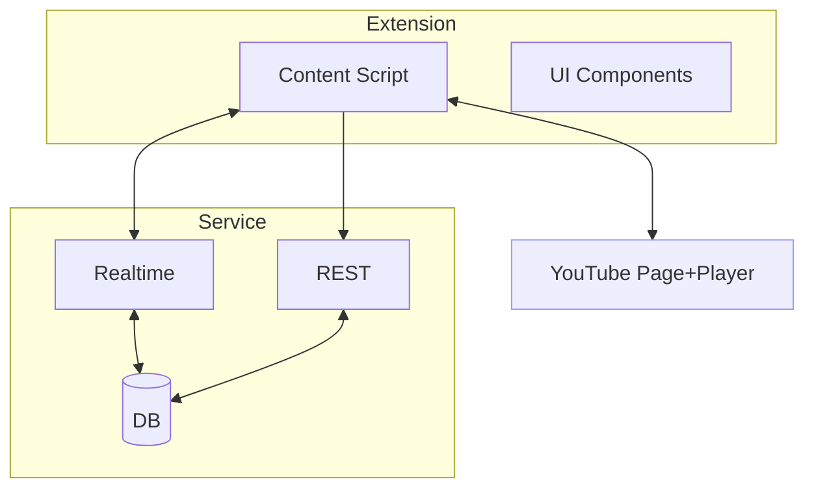
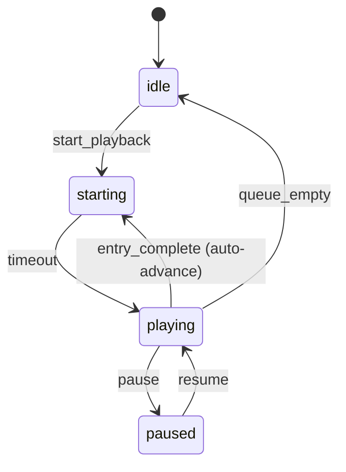
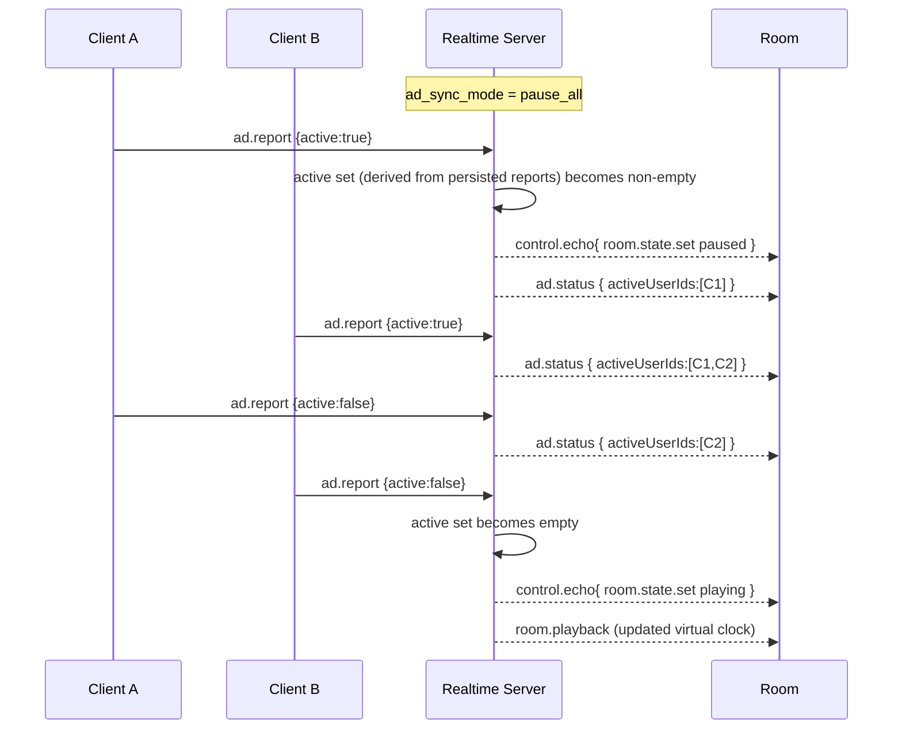
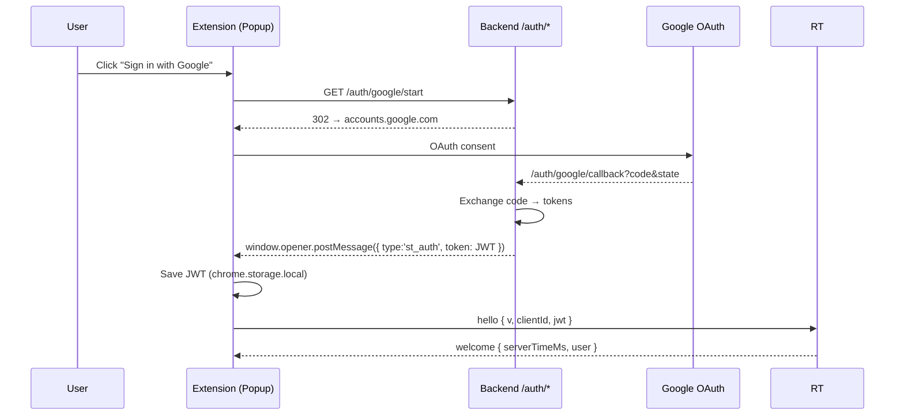

## ShareTube GAMEPLAN — Architecture, Sync Model, and Delivery Roadmap

### Cleverly Simple, Fresh Approach (Non-conforming to current code)
- **Server = Stateless Relay + Derived Room Clock**: No player telemetry, no per-user ad/state tracking, and no in-memory room/process state. All authoritative fields are persisted; playback position is derived at read time.
  - Creates rooms in the DB; runtime is thread- and process-agnostic.
  - Persists a minimal virtual clock per room updated only by control events; derives current position on demand from `playing_since_ms` or `paused_progress_ms`.
  - Always includes `serverNowMs` in replies for drift calibration and perfect sync.
- **Client = Enforcer**: Each extension instance enforces playback locally using the latest control echo and the room clock. Ads are handled purely on the client.
- **Single Controller (Baton)**: Exactly one `controllerId` can emit control events at a time. Default is room creator. Baton can be requested and granted; lease auto-expires on disconnect/inactivity.
- **Google Auth (Required)**: Extension performs Google OAuth via backend; backend issues a short-lived JWT. The JWT is mandatory for realtime connect and is stored in `chrome.storage.local`.
- **Minimal Persistence (Phase 1.0)**: A small DB is required to persist rooms, queue, and virtual clock fields (`duration_ms`, `playing_since_ms?`, `paused_progress_ms?`). No caches or in-memory state are used.
- **Hash-Based Join**: Extension appends `#st:<ROOM_CODE>` to YouTube URLs; on load, auto-join.
- **Minimal Protocol**: Control events are the only source of truth. Clients re-derive playback from `virtual_clock` and `serverNowMs`: if `playing_since_ms` is set, expected progress is `max(0, serverNowMs - playing_since_ms)`; otherwise use `paused_progress_ms`.

### Roles, Control, Presence, and Chat (Room UX)
- **Roles**
  - `owner` (room author): full control; manages operators and control mode.
  - `operator`: delegated control privileges; may control playback/queue depending on mode.
  - `participant`: view-only by default unless mode allows control.
- **Control Modes**
  - `owner_only`: only owner controls playback/queue; baton locked to owner unless overridden.
  - `operators`: owner and operators may control; baton can be transferred among them.
  - `any`: anyone in the room may control; baton arbitrates concurrent controls.
- **Baton (controllerId)**
  - Single active `controllerId`. Auto-assign to owner on room create. Voluntary transfer or owner override. Auto-expire on disconnect/inactivity.
- **Presence List**
  - Discord-like member list with role badges (owner crown, operator badge) and connection status.
- **Chat (ephemeral)**
  - In-room chat capped to last N messages (e.g., 100). Payload `{id, user, text, ts}`. Rate-limited and sanitized.

### Ad Sync (Room Setting)
- **Goal**: When any member gets a YouTube ad, pause everyone, display an overlay showing who is in ads, and auto-resume when all are clear. Optionally perform a brief warmup to trigger potential pre-rolls uniformly.
- **Setting**: `ad_sync_mode: 'off' | 'pause_all' | 'trigger_and_pause'`
  - `off`: Ignore ads; no special handling.
  - `pause_all`: On first `ad.report(active=true)`, server pauses room (via control echo), broadcasts `ad.status { activeUserIds }`, clients show overlay; auto-resume when `activeUserIds` becomes empty.
  - `trigger_and_pause`: On `play` from idle/starting, perform a short warmup window (e.g., ≤8s) where all clients start playback; if any reports ad during warmup or later, behave as `pause_all`. Intended to align pre-roll triggers when possible.
 - **Overlay**: Client shows an unobtrusive overlay listing avatars/names of users currently in ads; overlay hides automatically when list is empty.

### Purpose and Scope
- **Goal**: Design a robust, low-latency "watch together" system for YouTube that is pleasant to use, resilient to failure, and easy to evolve.
- **Scope**: Browser extension (content script) + backend service + realtime transport + minimal persistence + observability.
- **Style**: This is a living document. Keep sections short, decisive, and linked by references. Prefer explicit decisions with rationale.

### Guiding Principles
- **Simplicity first**: Smallest set of events and state needed for high-quality sync.
- **Client-enforced playback**: Extensions enforce playback locally; server maintains only the virtual room clock and shared queue. No per-client player tracking.
- **Idempotent, versioned messages**: Every message has a version and an idempotency key.
- **Recover gracefully**: Any disconnect/reload should converge quickly without user intervention.
- **Privacy**: Store the minimum user data; avoid sensitive scope unless necessary.
- **Observability**: Measure drift, latency, reconnects, and error rates from day one (without per-client player telemetry).

### Glossary (short)
- **Room**: Logical space where users synchronize playback.
- **Entry**: A queued YouTube video (by canonical video id).
- **Virtual clock**: `{ duration_ms, playing_since_ms?, paused_progress_ms? }` derived from control events; no per-client telemetry; computed on read.
- **Drift**: Difference between client-local current time and the room's virtual clock.

## System Overview

### Components
- **Browser Extension (MV3)**
  - Injects UI into YouTube pages (pill + queue panel).
  - Listens to YouTube player state and SPA navigation events.
  - Connects to backend via realtime transport, updates UI, and enforces playback.
- **Backend Service (Flask or similar)**
  - REST for metadata and health; realtime for rooms/presence/queue/state.
  - Persists minimal data (rooms, users, queues, memberships, audit).
- **Realtime Transport**
  - WebSocket (Socket.IO or native) with namespaced events.
  - Supports background tasks and broadcast to room channels.
- **Persistence**
  - Start with SQLite for local/dev. Abstract via ORM for future Postgres. Runtime is stateless: no in-memory per-room state or caches; derive current values on read.
- **Observability**
  - Structured logging; event counters; drift histograms; request tracing ids.

### High-Level Diagram (concept)


## Connectivity and Sync Model

### Identity and Access
- **Google OAuth required**: Users must sign in via Google to join/create rooms.
- **Flow (MV3-friendly)**: Extension opens `GET /auth/google/start` in a popup → backend redirects to Google → callback posts `{type:'st_auth', token}` to `window.opener` → extension stores `jwt` in `chrome.storage.local`.
- **JWT contents**: `sub` (Google subject), `name`, `picture`, `exp`. Optionally include an internal `uid` if a user table exists later.
- **Connection requirement**: Realtime `hello` must include a valid JWT; server rejects unauthenticated connects.
- **Room access**: Possession of code + valid JWT grants join. Private/owner controls can follow later.

### Connection Lifecycle
1) Client opens WS: `hello { v, clientId, jwt }` (jwt required).
2) Server replies `welcome { serverTimeMs, user:{id,name,picture}, minVersion }`.
3) Client either creates or joins a room. On success, server emits snapshot events.
4) Heartbeats piggyback on activity; idle keepalive every N seconds.

### Time and Drift
- Server includes `serverNowMs` in welcome and periodic `pong` to calibrate RTT/offset.
- Playback is represented by per-entry persisted `virtual_clock` fields on the current queue entry (`duration_ms`, `playing_since_ms?`, `paused_progress_ms?`). The server updates these fields only on control events (play/pause/seek/queue-change) and derives current progress at response time. No in-memory state is used.
- Client computes local expected position from the `virtual_clock` and `serverNowMs`; if |drift| > threshold (e.g., 400ms), snap; else smooth.

## Room and Playback State

### Room Entity (minimum viable)
- `code: string`
- `owner_id: string` (from JWT `sub` or internal `uid`)
- `control_mode: 'owner_only' | 'operators' | 'any'`
- `controller_id: string` (current baton holder)
- `operators: Set<string>` (user ids)
- `ad_sync_mode: 'off' | 'pause_all' | 'trigger_and_pause'`
- `state: 'idle' | 'starting' | 'playing' | 'paused'`
- `current_entry_id: nullable`

### Membership (dynamic)
- `user_id | guest_id`
- `active: bool`
- `role: 'owner' | 'operator' | 'participant'`

### Queue
- `entries: [ { id, video_id, url, title, thumbnail_url, position, status, watch_count, duration_ms, playing_since_ms?, paused_progress_ms?, progress_ms?, paused_at? } ]`
- Status: `queued | skipped | deleted`. "Watched" is derived: an entry is considered watched when `watch_count > 0`.

#### Queue Playback Policy (Auto-Rotate)
- Play order is head-first: always play the entry with the lowest `position` (`entries[0]`).
- On entry completion, move the just-finished head entry to the tail of the queue instead of removing it (i.e., rotate). Positions are re-numbered to maintain order.
- On entry completion, increment the entry's `watch_count` before rotation. An entry is treated as watched if `watch_count > 0`.
- Auto-advance is seamless: when the current entry completes (derived from `virtual_clock.duration_ms`), the server rotates the queue and transitions to play the next entry.
- The queue never shrinks automatically on completion. Removal only happens via explicit `queue.remove` or `queue.replace`.


### State Transitions


## Event Taxonomy and Contracts

### Envelope (all messages)
```json
{
  "type": "room.join",           // dotted, namespaced
  "v": 1,                         // schema version
  "ts": 1730000000000,            // client send time
  "reqId": "uuid-...",           // for correlating replies
  "roomCode": "ABCD1234"         // optional on global events
}
```

### Client → Server (core)
- `room.create {}` → `{ ok, code }`
- `room.join { code }` → `{ ok, code }`
- `room.leave { code }` → `{ ok }`
- `queue.add { code, item:{ url|id } }` → `{ ok, entry }`
- `queue.remove { code, id }` → `{ ok }`
- `queue.replace { code, items:[{url|id}] }` → `{ ok }`
- `room.state.set { code, state }` → `{ ok }`  
  (server updates virtual clock from control events only)
- `room.seek { code, progress_ms, play }` → `{ ok }`
- `room.control_mode.set { code, mode:'owner_only'|'operators'|'any' }` → `{ ok }` (owner only)
- `room.operator.add { code, userId }` / `room.operator.remove { code, userId }` → `{ ok }` (owner only)
- `room.controller.set { code, controllerId }` → `{ ok }` (owner only or self when baton available)
- `chat.send { code, text }` → `{ ok, id, ts }`
- `ad.report { code, active:boolean }` → `{ ok }` (client heuristic; rate-limited)
- `ad.policy.set { code, mode:'off'|'pause_all'|'trigger_and_pause' }` → `{ ok }` (owner only)

### Server → Client (core)
- `room.join.result { ok, code, snapshot }`
- `room.presence { code, members:[...] }` (optional in early phases)
- `room.snapshot { code, ownerId, controlMode, controllerId, operators:[...], state, virtual_clock, items:[...] }` (on join and periodic)
- `control.echo { type:'room.state.set'|'room.seek'|'queue.*', roomCode, serverNowMs, payload, controllerId }`
- `room.permissions { code, ownerId, controlMode, controllerId, operators:[...] }` (emit on any role/mode/baton change)
- `chat.message { code, id, user:{id,name,picture}, text, ts }`
- `ad.status { code, activeUserIds:[...] }`

### Idempotency and Dedupe
- Each client-sent mutating event includes `reqId`. Server stores short-lived dedupe cache (e.g., 60s) per `(userId|guestId, reqId)`.
- Server replies include `reqId` where available.

### Versioning
- Envelope includes `v`. Server rejects unsupported versions with `upgrade.required { minVersion }`.

## YouTube Integration Strategy

### Player Observability
- Prefer official YouTube Player API when present; otherwise observe DOM mutations and timeupdate events.
- Hook SPA signals: `yt-navigate-start`, `yt-navigate-finish`, `hashchange`, `popstate`.
- Detect current video id from URL; keep hash `#sharetube:<CODE>` when navigating.

### Ad Handling (client-only)
- Detection is client-only via DOM markers or Player API flags. Clients emit `ad.report { active }` on changes (throttled). Server updates ad status fields on `RoomMembership` for the `(room_id, user_id)` and derives the active set on demand; it then broadcasts `ad.status`.
- When `ad_sync_mode='pause_all'|'trigger_and_pause'` and the derived active set transitions from empty→non-empty, server emits a control echo to pause room (and persists the updated virtual clock). When it transitions to empty, server resumes previous state and persists the virtual clock accordingly. No in-memory sets are maintained.

#### Ad set derivation (TTL/Debounce)
- **Flapping**: Ad detectors can toggle rapidly. Avoid room pause/resume oscillations.
- **Persisted membership fields**: For each `(room_id,user_id)`, store `ad_active:boolean`, `ad_last_true_ts:number`, `ad_last_false_ts:number` in `RoomMembership`.
- **TTL (time-to-live)**: Consider a user "active in ads" only if their last true report is recent.
  - Active if `serverNowMs - ad_last_true_ts ≤ ACTIVE_TTL_MS` (e.g., 6–10s). This auto-clears stale "true" if a "false" was missed.
- **Debounce (dwell time)**: Require stability before changing an individual user's status.
  - Active debounce: only set `ad_active=true` if `active:true` has been continuously true for ≥ `MIN_ACTIVE_MS`.
  - Inactive debounce: only set `ad_active=false` if `active:false` has been continuously false for ≥ `MIN_INACTIVE_MS`.
  - Optional hysteresis: use slightly longer inactive debounce than active to reduce oscillation.
- **Room-level grace**: Only issue pause/resume when the derived active set crosses empty/non-empty and remains so for ≥ `ROOM_TRANSITION_GRACE_MS`.

Recommended defaults:
- `ACTIVE_TTL_MS = 8000`
- `MIN_ACTIVE_MS = 700`
- `MIN_INACTIVE_MS = 900`
- `ROOM_TRANSITION_GRACE_MS = 300`

### Local Enforcement
- When room state is `playing`, ensure local player is playing at expected position (snap if drift > threshold).
- When `paused`, pause locally.
- When `playing_ad`, never attempt to pause ads; instead pause content and show overlay.

## Consistency Model and Algorithms

### Authoritative Virtual Clock (server)
- Maintain the virtual clock for the current entry purely from control events; persist only minimal fields. No per-client inputs are stored.
  - On `play` from paused or start: set `playing_since_ms = serverNowMs - paused_progress_ms` (use 0 if starting from the beginning); clear `paused_progress_ms`.
  - On `pause`: set `paused_progress_ms = max(0, serverNowMs - playing_since_ms)`; clear `playing_since_ms`.
  - On `seek { progress_ms, play }`: set `paused_progress_ms = progress_ms`; if `play=true`, then set `playing_since_ms = serverNowMs - progress_ms` and clear `paused_progress_ms`.

### Client Drift Correction
### Ad Sync Flow

- Compute expected position: if `playing_since_ms` is set → `expected = max(0, now - playing_since_ms)`; else `expected = paused_progress_ms`.
- If `abs(local - expected) > DRIFT_SNAP_MS` (e.g., 400ms), snap; else apply small rate adjustments.
- Recompute on each `room.playback` and on local `timeupdate` with throttling.


## Failure Modes and Recovery

- **Disconnect**: Client buffers local actions (queue adds) with `reqId`. On reconnect, resends with same `reqId`.
- **Page navigation**: Re-bootstrap app; if hash contains room code, auto-join.
- **Background tabs**: Reduce event frequency; rely on server state for snap on focus.
- **Server restarts**: Clients reconnect; server rebuilds snapshots from DB; idempotency prevents duplicates.
- **Clock skew**: Use server `pong` round-trip to estimate offset and clamp corrections.

## Security and Abuse Resistance

- **Input validation**: Strictly validate room codes, video ids, and payload shapes.
- **Rate limiting**: Per-connection and per-user limits for mutating events.
- **Auth (required)**: Validate backend-issued JWT (HS256) with proper `aud/iss` and short `exp` (e.g., 24h). No Google tokens over WS.
- **CORS/Origins**: Restrict REST to your domain; WS allowed origins limited to extension context and your site.
- **Privacy**: Store minimal profile; avoid long-lived tokens. Re-auth on expiry.
- **Chat hygiene**: Truncate and sanitize text (length cap, allowlist), rate-limit `chat.send`, and drop on violations.
- **Ad report hygiene**: Throttle `ad.report`; ignore oscillations faster than a minimum dwell time; cap active set size for payload.

## Data Model (Draft)

- `User { id, google_sub?, email?, name?, picture? }`
- `Room { id, code, owner_id, created_at, is_private, control_mode, controller_id, state }`  
  plus persisted `virtual_clock { duration_ms, playing_since_ms?, paused_progress_ms? }` and `operators:Set<id>`.
- `RoomMembership { id, room_id, user_id?, guest_id?, active }`
  - `ad_active: boolean` (derived with debounce/TTL; last computed state)
  - `ad_last_true_ts: number` (ms since epoch when `active:true` was last seen)
  - `ad_last_false_ts: number` (ms since epoch when `active:false` was last seen)
- `Queue { id, room_id, created_by_id?, created_at }`
- `QueueEntry { id, queue_id, added_by_id?, url, video_id, title, thumbnail_url, position, status }`
- `QueueEntry.watch_count: int` (defaults to 0; increment on each completion/auto-advance)
 - `QueueEntry.progress_ms: int` (last known progress in ms when paused; used for resume)
 - `QueueEntry.paused_at: ts` (unix seconds when the entry was last paused)
- `RoomAudit { id, room_id, user_id?, event, details, created_at }`
- `ChatMessage { id, room_id, user_id, text, ts }` (optional, ephemeral or capped persistence)
  

## Minimal REST Surface (Initial)

- `GET /health` → `{ ok }`
- `GET /api/youtube/metadata?url|id` → `{ title, thumbnail_url, duration_ms }` (best-effort)
- `GET /auth/google/start` / `GET /auth/google/callback` (required)

## Realtime Surface (Initial)

- Start with: `hello`, `room.create`, `room.join`, `queue.replace`, `queue.add`, `queue.remove`, `room.state.set`, `room.seek`.
- Add when enabling roles/chat: `room.control_mode.set`, `room.operator.add/remove`, `room.controller.set`, `chat.send`.
- Add for ad sync: `ad.report`, `ad.policy.set`.
- Server broadcasts: `control.echo`, periodic `room.snapshot`, `room.permissions`, `chat.message`, `ad.status`.

## Observability

- **Structured logs**: Include `reqId`, `roomCode`, and `userId|guestId` where applicable.
- **Metrics**: Counters for events; histograms for drift; gauges for active rooms/users.
- **Sampling**: Periodic `drift.sample { localMs, expectedMs }` from clients (rate-limited) for SLOs.

## Delivery Plan (Phases)

### Phase 0 — Clean Slate and Skeleton
- Prune legacy features; keep health endpoint and empty room scaffolding.
- Establish code structure, message versioning, and lint/test harness.

### Phase 1 — Core Sync With Google Auth
- Implement `/auth/google/start` + callback → issue short-lived JWT.
- Extension popup flow + token storage; WS handshake requires JWT.
- Implement rooms, queue, and virtual clock state machine.
- Content script: detect video id, basic controls, and drift correction.
- Hash-based join; clipboard link sharing.

### Phase 2 — Identity and Presence
- Add `room.presence` and soft-online tracking using authenticated profiles.

### Phase 3 — Ad Handling and Resilience
- Implement ad detection heuristics and `playing_ad` flow.
- Harden reconnect, navigation, and dedupe logic.

### Phase 4 — Dashboard and Ops
- Add minimal dashboard for observing rooms, drift, and events.
- Add metrics export and log enrichment.

## Open Questions (to decide before coding each phase)

- What is the acceptable max drift before snap for best UX on varied networks? 300–500ms?
- Should `starting` wait for majority readiness or fixed timeout?
- Queue policy: who can add/remove when room is private? Owner-only vs. all?
- How to encode guest identity (ephemeral id) to balance privacy and abuse prevention?
- Do we need optimistic UI for queue changes before server ack, or strict server round-trip?

## Message Schemas (Draft; v1)

```json
// control.echo (server → client)
{
  "type": "control.echo",
  "v": 1,
  "roomCode": "...",
  "serverNowMs": 1730000000000,
  "controllerId": "client-123",
  "payload": { "type": "room.state.set", "state": "playing" }
}
```

```json
// room.state.set (client → server)
{
  "type": "room.state.set",
  "v": 1,
  "roomCode": "...",
  "state": "playing",        
  "reqId": "uuid-..."
}
```

```json
// room.seek (client → server)
{
  "type": "room.seek",
  "v": 1,
  "roomCode": "...",
  "progress_ms": 1800,
  "play": true,
  "reqId": "uuid-..."
}
```

```json
// room.snapshot (server → client)
{
  "type": "room.snapshot",
  "v": 1,
  "roomCode": "...",
  "ownerId": "user-999",
  "controlMode": "operators",
  "state": "playing",
  "controllerId": "client-123",
  "operators": ["user-111", "user-222"],
  "virtual_clock": { "duration_ms": 220000, "playing_since_ms": 1730000000000 },
  "items": [ { "id": 1, "video_id": "XXXXXXXXXXX", "title": "...", "watch_count": 0 } ]
}
```

```json
// chat.message (server → client)
{
  "type": "chat.message",
  "v": 1,
  "roomCode": "...",
  "id": "msg-abc",
  "user": { "id": "user-111", "name": "Sam", "picture": "..." },
  "text": "let's start at 0:15",
  "ts": 1730000000000
}
```

```json
// ad.status (server → client)
{
  "type": "ad.status",
  "v": 1,
  "roomCode": "...",
  "activeUserIds": ["user-111", "user-222"],
  "ts": 1730000000000
}
```

```json
// ad.report (client → server)
{
  "type": "ad.report",
  "v": 1,
  "roomCode": "...",
  "active": true,
  "ts": 1730000000000
}
```

## Test Strategy (incremental)

- **Unit**: State-machine transitions; idempotency cache; URL/id parsing.
- **Integration**: Client/server event flows; reconnect; seek; queue replace.
- **E2E (later)**: Two controlled browser contexts w/ scripted player time.

## Edit Workflow

- Keep this document canonical. Use small sections, bullet points, and mermaid diagrams.
- When making a decision, add a short Decision Record below with status.

### Decision Records
- [ ] Transport: Socket.IO vs. native WS. Status: proposed. Rationale: namespaces, rooms, and backpressure handling.
- [x] Auth: Google OAuth required. Status: accepted. Rationale: stable identity and permissions.
- [ ] Drift snap threshold 400ms. Status: proposed. Rationale: balance UX vs. churn.

## Auth Flow (MV3) — Sequence
