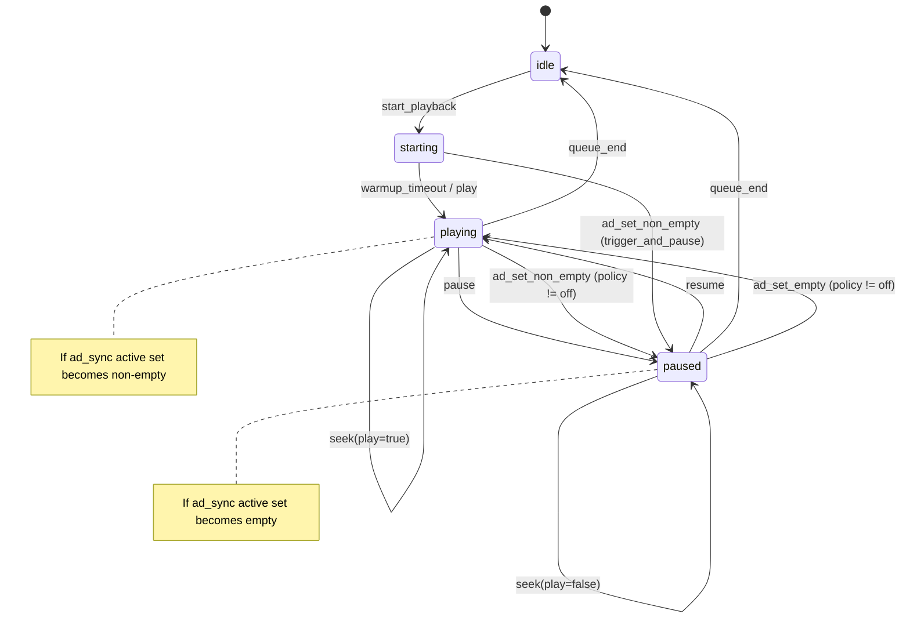
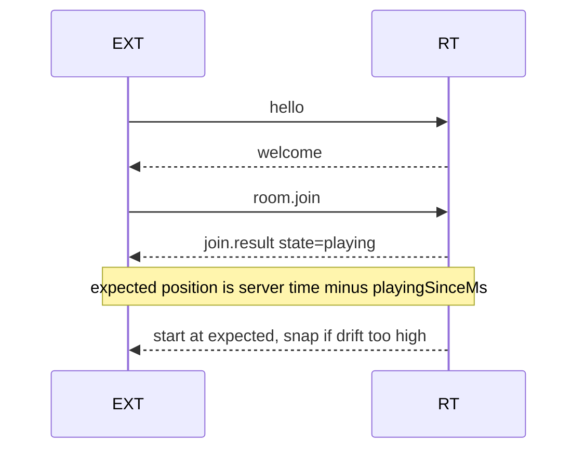
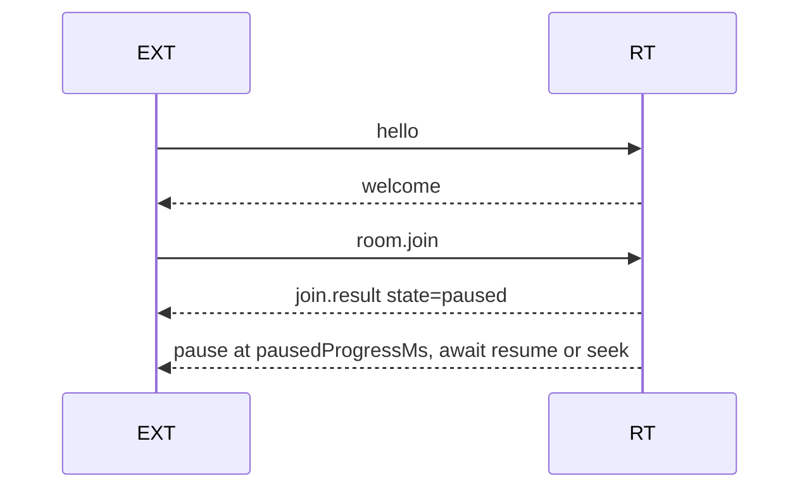
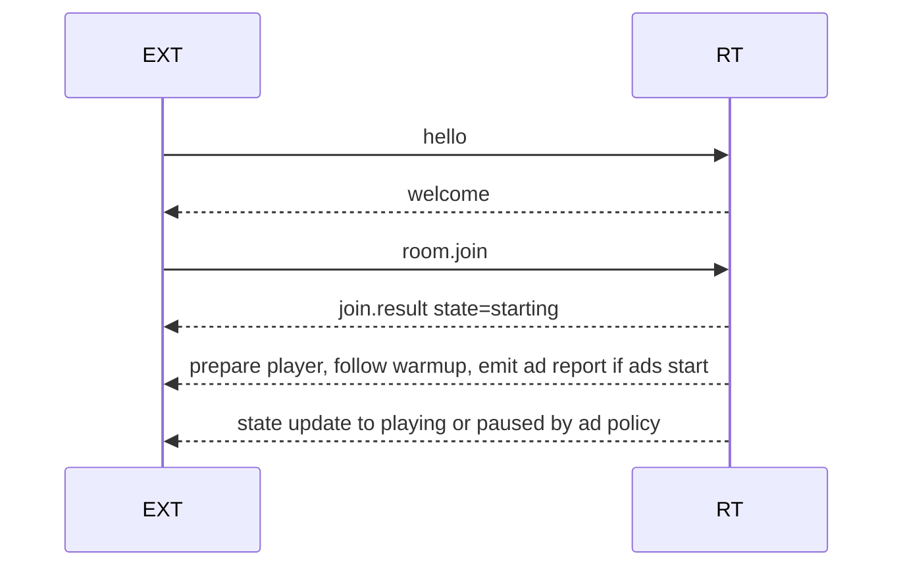
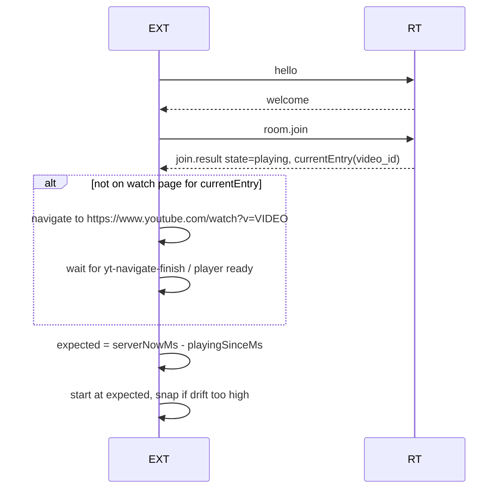
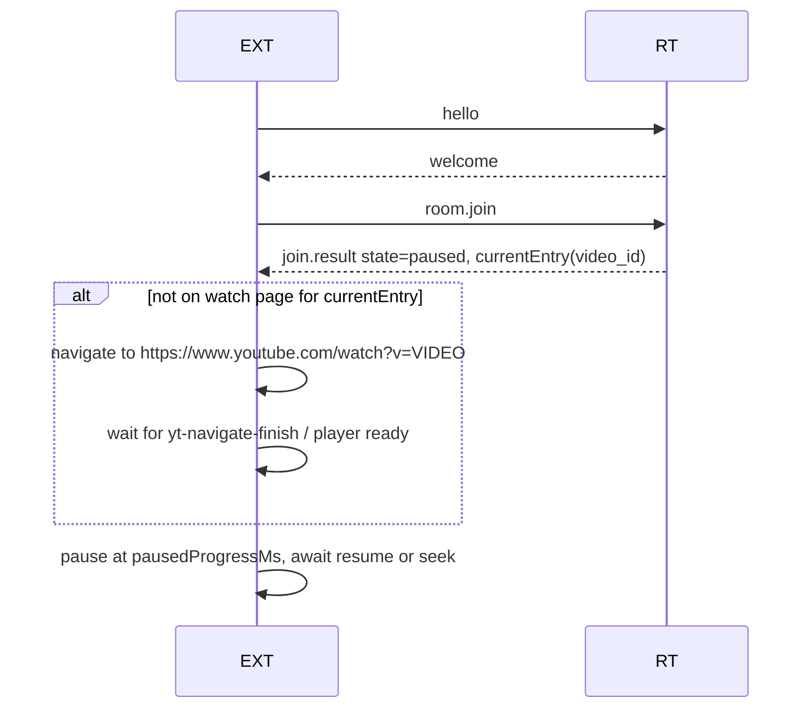
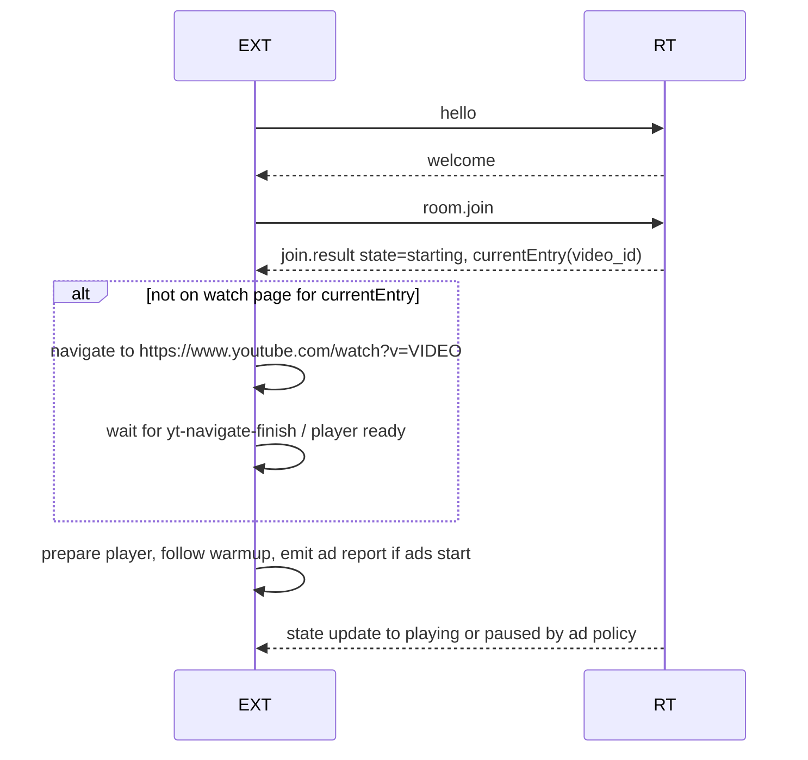
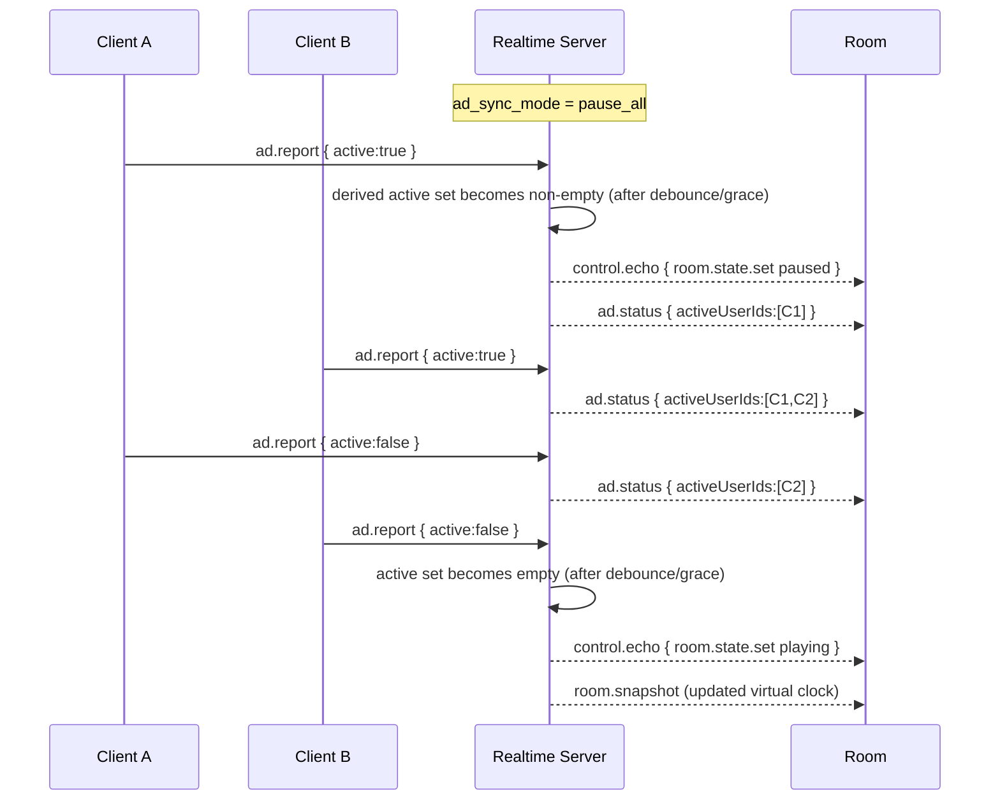

## ShareTube STATE-FLOW — Room State Machine and Client Reactions

This doc translates the core state model from `GAMEPLAN.md` into concrete room state transitions and prescriptive client behavior (connected and joining). Diagrams are in Mermaid (aka our “dolphin diagrams”).

### Authoritative Room States
- `idle`: No active playback; between items or before first play.
- `starting`: Short warmup window to align clients (especially for `ad_sync_mode='trigger_and_pause'`).
- `playing`: Room is playing content; position derived from virtual clock.
- `paused`: Room is paused; position stored in `paused_progress_ms`.

Virtual clock (authoritative, persisted): `virtual_clock { duration_ms, playing_since_ms?, paused_progress_ms? }`.

Global rules:
- Server never tracks per-client player time. It persists the virtual clock on control events and includes `serverNowMs` in messages.
- Clients compute expected position: if `playing_since_ms` → `expected = max(0, serverNowMs - playing_since_ms)` else `expected = paused_progress_ms`.
- Clients snap if `|local - expected| > DRIFT_SNAP_MS` (proposed ~400ms), else smooth.

### Master State Machine (Room)

Notes:
- `start_playback` is typically owner/controller initiated when a current entry exists.
- `warmup_timeout` should be short (≤ ~8s) and may be skipped when not using `trigger_and_pause`.
- Ad sync does not introduce a new room state; it toggles between `playing` and `paused` via control echoes.

### Server-Side Semantics per Event
- `room.state.set { state: 'playing' }`: set `playing_since_ms = serverNowMs - (paused_progress_ms || 0)`; clear `paused_progress_ms`.
- `room.state.set { state: 'paused' }`: set `paused_progress_ms = max(0, serverNowMs - playing_since_ms)`; clear `playing_since_ms`.
- `room.seek { progress_ms, play }`:
  - Always set `paused_progress_ms = progress_ms`.
  - If `play=true`, also set `playing_since_ms = serverNowMs - progress_ms` and clear `paused_progress_ms`.
- `queue_end`: clear current entry; transition to `idle`.
- `ad.report { active }`: persisted per `(room_id,user_id)` with TTL/debounce; server derives active set and, if policy is not `off`, issues pause/resume when active set crosses empty/non-empty with grace period.

Recommended ad sync thresholds (see `GAMEPLAN.md`): `ACTIVE_TTL_MS≈8000`, `MIN_ACTIVE_MS≈700`, `MIN_INACTIVE_MS≈900`, `ROOM_TRANSITION_GRACE_MS≈300`.

### Client Reaction Matrix

For each room state, clients (both already connected and new joiners) must react deterministically to converge to shared playback.

#### idle
- Server broadcasts: `room.snapshot` (state=`idle`), periodic snapshots.
- Connected clients:
  - Do not play content; show queue/ready UI.
  - If user holds baton and starts playback → send `room.state.set { state:'playing' }` or `start_playback` which places room into `starting` first (policy-dependent).
- Joining clients:
  - Join; render UI in idle. No playback actions.

#### starting
- Purpose: short warmup to align autoplay/ad triggers; usually only when `ad_sync_mode='trigger_and_pause'`.
- Server broadcasts: `room.snapshot` (state=`starting`). After timeout, server moves to `playing` (unless ad set becomes non-empty first in `trigger_and_pause`).
- Connected clients:
  - Prepare player; optionally begin brief local play if directed by echo/flow.
  - If ad detected locally, emit `ad.report { active:true }`.
- Joining clients:
  - On snapshot `starting`, quickly bootstrap player; follow same warmup behavior.

#### playing
- Server broadcasts: `control.echo` and periodic `room.snapshot` with `virtual_clock.playing_since_ms`.
- Connected clients:
  - Ensure local player is playing at `expected` position; snap if drift > threshold.
  - If local ad detected, do NOT try to pause ads; pause content track locally and show ad overlay; emit `ad.report { active:true }`.
  - Apply `seek` and `state` echoes idempotently.
- Joining clients:
  - On `room.snapshot` with `playing_since_ms`, compute `expected`; start playback at `expected` immediately; snap if needed.

#### paused
- Server broadcasts: `control.echo` and snapshots with `virtual_clock.paused_progress_ms`.
- Connected clients:
  - Ensure local player is paused at `paused_progress_ms`.
  - If ad_sync was active and active set becomes empty, expect resume echo to `playing`.
- Joining clients:
  - Pause locally at `paused_progress_ms`. Do not auto-play until a `playing` echo arrives.

### Join Flows (Dolphin Diagrams)

Join while room is playing:

Join while room is paused:

Join during warmup (starting):

### Join When Not On Video Page (Redirect Before Sync)

If the client is not currently on a YouTube watch page for the room’s current entry, it must navigate there first, then perform state sync.

Client redirect rules:
- On `join.result`, if state ∈ {`starting`,`playing`,`paused`} and a current entry is known, construct the canonical watch URL and navigate:
  - URL: `https://www.youtube.com/watch?v=<video_id>#st:<ROOM_CODE>` (fallback: use `url` if `video_id` absent).
  - Preserve the `#st:<ROOM_CODE>` hash on future navigations.
- Wait for YouTube SPA readiness before syncing playback:
  - Observe `yt-navigate-finish` or equivalent DOM-ready signals.
  - Ensure player API/DOM is available.
- After page ready, apply the same per-state client reactions defined above.
- If state=`idle`, no redirect is required until playback is initiated or a user action chooses an entry.

Redirect and sync (playing):

Redirect and sync (paused):

Redirect and warmup (starting):

Edge cases:
- If the room is `playing` but `currentEntry` is not present in the snapshot, delay navigation briefly and retry on the next `room.snapshot` or use a provided canonical `url`.
- If navigation is blocked (popup/permissions), display an in-page prompt to click to proceed; continue to hold off on sync until on the watch page.

### Ad Sync Flow (Room-wide)

When ad sync policy is active (`pause_all` or `trigger_and_pause`), the server derives an active ad set and toggles room play/pause accordingly.

Client-side ad handling rules:
- Never attempt to pause an ad mid-roll; pause content track and display the overlay listing `activeUserIds`.
- Overlay hides automatically when `activeUserIds` set becomes empty.
- Continue to enforce local playback/pause according to room echoes even while ads run.

### Control Authority and Baton
- Only the current `controllerId` (baton holder) may emit control events in modes that restrict control. Owner can override transfer.
- Baton changes emit `room.permissions` so clients update UI affordances (enabled/disabled controls).

### Failure and Recovery Behaviors
- Disconnect/reconnect: Clients resend buffered actions with same `reqId`; state converges via snapshots and idempotency.
- Navigation: If URL hash contains `#st:<CODE>`, auto-join and follow the appropriate join flow above.
- Background tabs: Reduce local processing frequency; resync on focus using latest `room.snapshot`.

### Implementation Notes
- All messages versioned with `v` and idempotency key `reqId` on mutating events.
- Server must include `serverNowMs` in welcome and relevant echoes to support drift calibration.

